# **Analisi Esplorativa Avanzata (EDA)**

   

Analisi descrittiva su 20M+ corse per identificare pattern comportamentali utili a modellazione e strategia.\
Segmenti analizzati: *Member (pendolari)* vs *Casual (turismo/tempo libero)*.

Dataset: `trips_with_weather`

## 1. Composizione Utenti

I due segmenti mostrano volumi e stabilità molto diversi.

| Segmento | \% Mix  | Insight                       |
|----------|---------|-------------------------------|
| *Member* | **61%** | Domanda stabile e prevedibile |
| *Casual* | **39%** | Domanda altamente stagionale  |

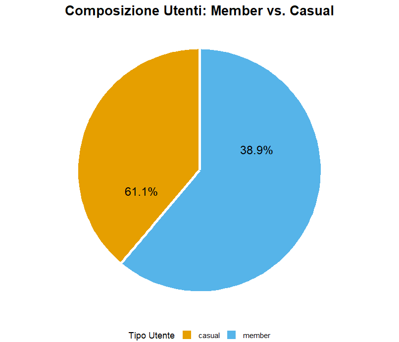

*Pattern chiave:* i Member sostengono l’utilizzo annuale; i Casual generano picchi concentrati.

## 2. Durata della Corsa (Driver Principale)

La durata è la variabile più discriminante.

| Segmento | Media          | Mediana  | Interpretazione          |
|----------|----------------|----------|--------------------------|
| *Member* | **\~12.7 min** | 9.1 min  | Uso funzionale/commuting |
| *Casual* | **\~24.9 min** | 14.3 min | Uso ricreativo/turistico |

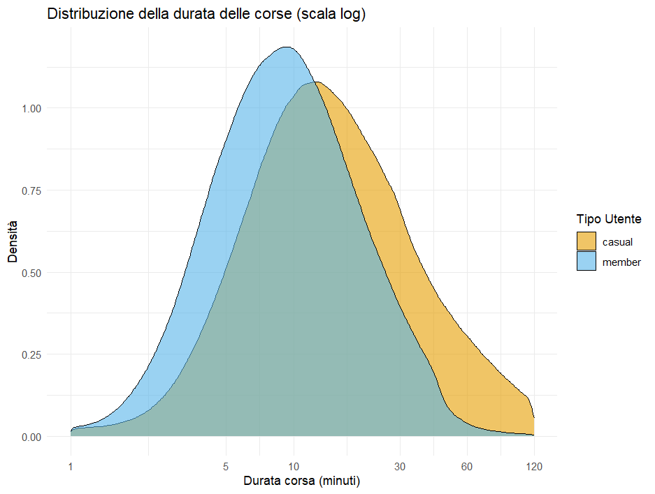

➡ Le corse lunghe sono un segnale di comportamento “Casual” e saranno driver chiave nei modelli.

## 3. Pattern Temporali

### 3.1 Giorni della Settimana

| Dimensione    | Member    | Casual       |
|---------------|-----------|--------------|
| Picco         | Lun–Gio   | Ven–Dom      |
| Comportamento | commuting | tempo libero |

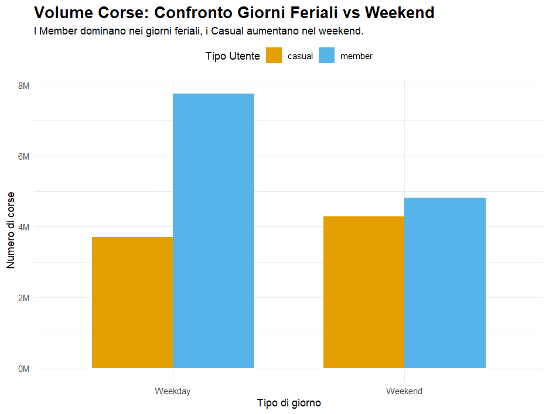

### 3.2 Fasce Orarie

-   *7–9 / 16–18* → dominanza Member (pendolarismo)
-   *12–18* → dominanza Casual (tempo libero)

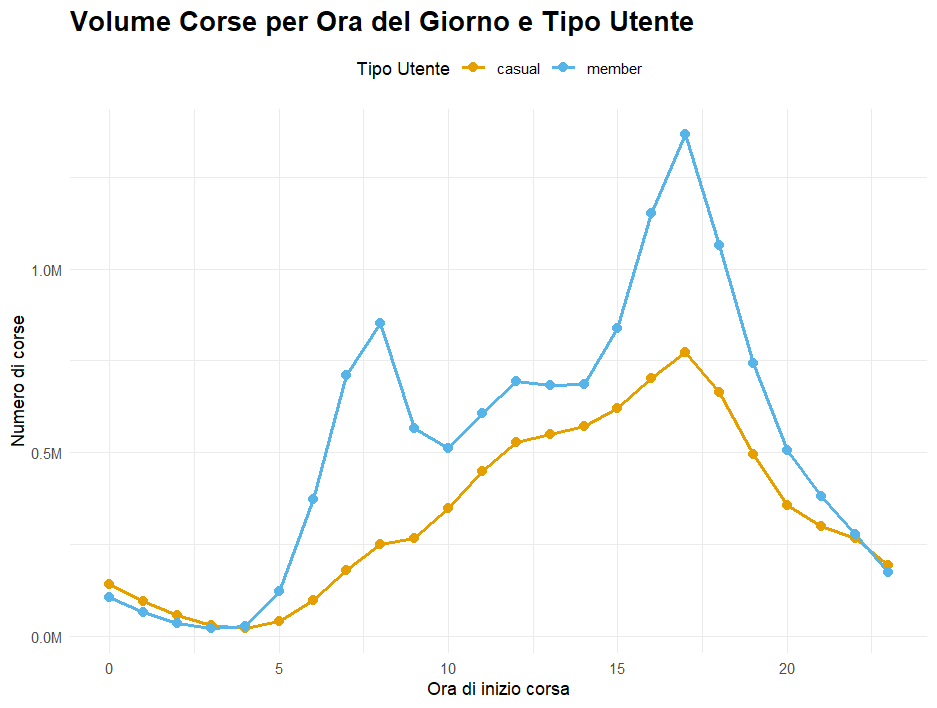

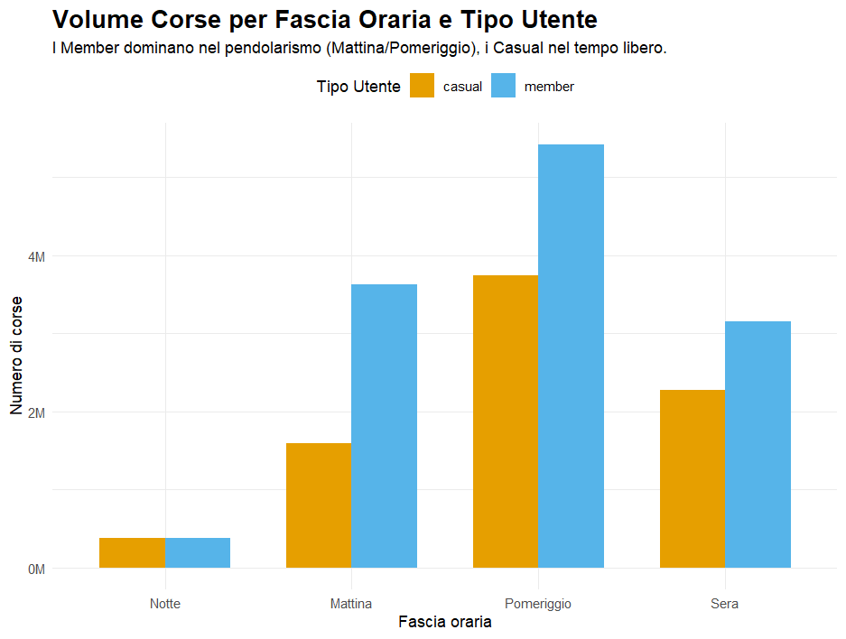

### 3.3 Stagionalità Annuale

-   *Member:* calo moderato in inverno
-   *Casual:* volume concentrato in Apr–Set, picco Lug–Ago

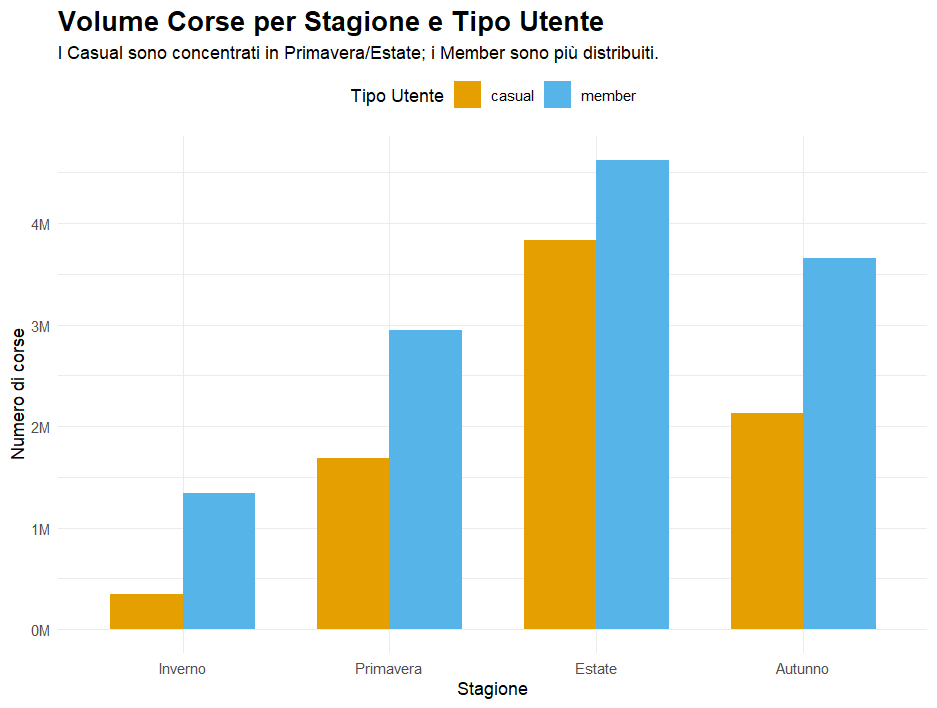 ➡ La stagione è una delle dimensioni più informative per il segmento Casual.

## 4. Dimensione Spaziale

### 4.1 Stazioni

Distribuzione geografica coerente con i due segmenti:

| Segmento | Localizzazione tipica                      |
|----------|--------------------------------------------|
| *Member* | commuting hub, zone business/residenziali  |
| *Casual* | waterfront, musei, parchi, aree turistiche |

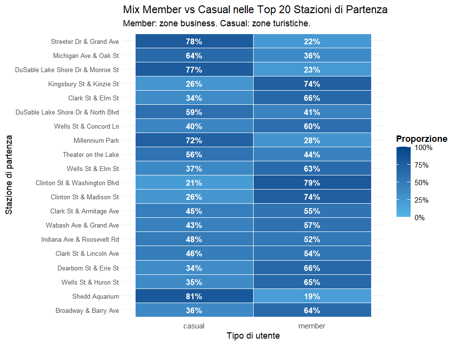

➡ Le stazioni fungono da proxy comportamentale.

### 4.2 Tipo di Bici

-   *Classic bike:* prevalente in entrambi i segmenti
-   *E-bike:* crescente, più utilizzata dai Casual
-   *Docked/Eletric scooter:* quasi esclusivamente Casual

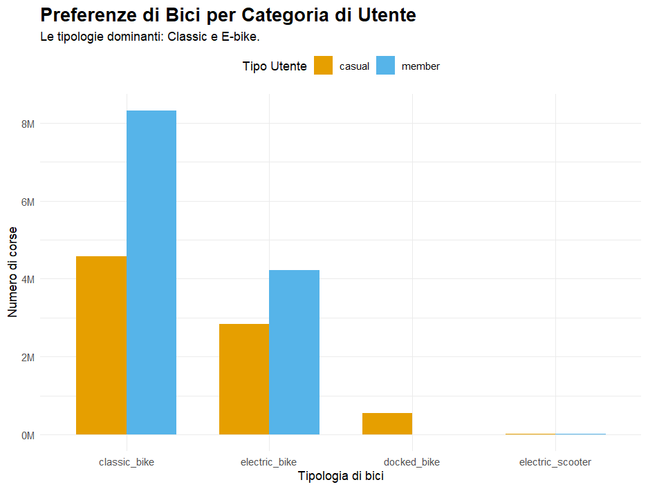

## 5. Meteo: Effetti sul Mix Utenti

Il meteo non influisce solo sul volume, ma su chi utilizza il servizio.

### 5.1 Temperatura

La temperatura è il driver meteorologico più forte e mostra profili comportamentali molto diversi.

-   *\<5°C (Freddo)*: crollo dei Casual (\~−80%); i Member restano relativamente più attivi.

-   *5–15°C (Fresco)*: fase di transizione; i Member feriali mostrano maggiore resilienza.

-   *15–25°C (Mite)*: condizione ideale → baseline di utilizzo massimo per entrambi i segmenti.

-   *≥25°C (Caldo)*: riduzione più marcata tra i Member (specialmente nel weekend).

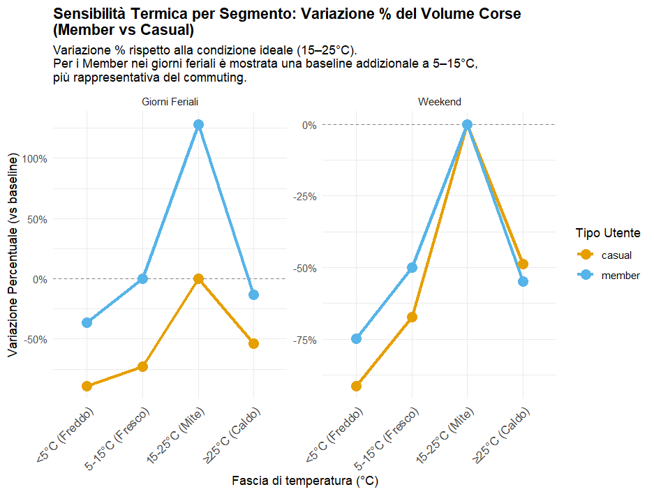

➡ Le temperature estreme amplificano la distanza tra i due segmenti.

### 5.2 Pioggia

La pioggia riduce il volume per tutti, ma seleziona maggiormente utenti con esigenze funzionali.

-   *Casual*: −67%

-   *Member*: −63%

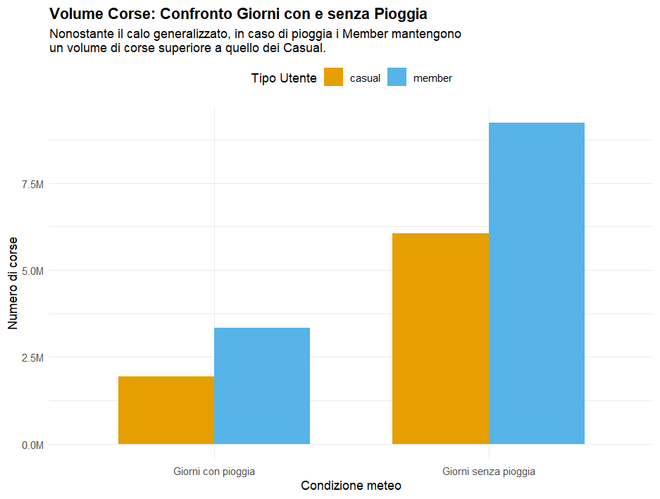

➡ I Member mantengono un volume relativamente più alto → utilizzo “necessario” (commuting), non ricreativo.

### 5.3 Neve

La neve è un evento di paralisi, non un filtro comportamentale.

-   Quasi azzera l’utilizzo in entrambi i segmenti.

-   Il servizio diventa poco praticabile anche per i pendolari (*Member*).

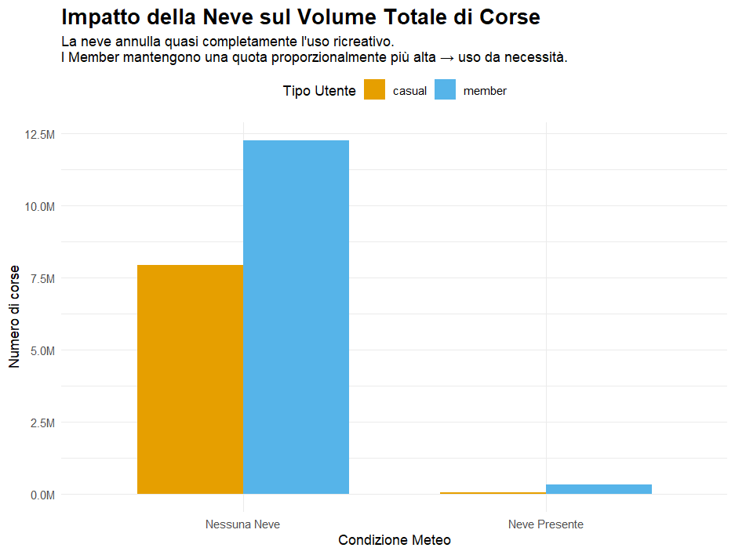

➡ La neve è un boundary condition: non distinguere i segmenti, li spegne entrambi.

### 5.4 Vento

Il vento ha un impatto significativo, soprattutto nella fascia moderata (20–40 km/h).

-   *Vento debole (\<20 km/h)*: baseline;

-   *Vento moderato (20–40 km/h)*: forte riduzione per entrambi

    1.  Casual: −82.7%
    2.  Member: −78.9%

-   *Vento Forte (≥40 km/h)*: quasi assenza di corse → condizioni proibitive o limiti nel dato giornaliero.

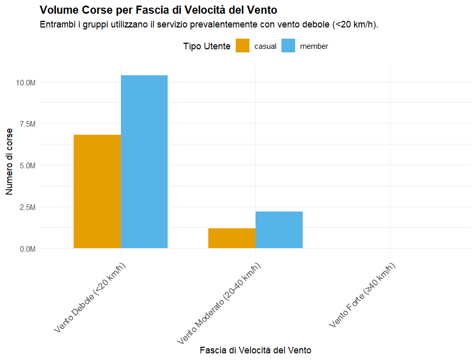

➡ Il vento agisce come barriera fisica, non comportamentale: riduce la domanda allo stesso modo nei due segmenti.

## Output Operativi dell’EDA

L’EDA fornisce insight chiave per passare alla fase predittiva:

-   Identifica feature realmente informative (no ridondanze, no leakage);

-   Dimostra che i pattern Member/Casual sono strutturati e non casuali;

-   Evidenzia comportamenti stabili nel tempo e robusti alla variazione annuale;

-   Crea una base coerente per raccomandazioni business e strategia di conversione.

## Collegamenti

-   Pipeline: [pipeline_details.md](pipeline_details.md)
-   Modelli ML: [ML_models.md](ML_models.md)
