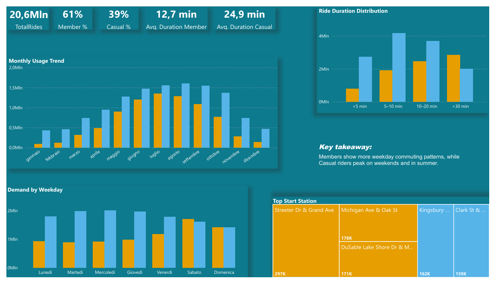

# 🚴 Cyclistic Bike-Share (Chicago) — Behavioral Analytics & Data Strategy


**Final dataset:** ~21M rides (cleaned) · **Period:** 2021–2025 · **Stack:** PostgreSQL · R · SQL · Power BI · ML  
**Repository:** End-to-end project with scalable pipeline, EDA, modeling checks, and actionable recommendations.

---

## Project Goal

Analyze 58 months of Cyclistic ride data to:

1. Identify usage patterns for **Members vs Casual** riders  
2. Build a **scalable pipeline** for large datasets  
3. Integrate **multi-year weather data** (Meteostat)  
4. Validate behavioral signals using **predictive modeling** (as a supporting check)  
5. Translate insights into **operational and conversion actions**

---

## Project Architecture

### 1) Data Engineering
- Automated CSV ingestion
- Cleaning, deduplication, and feature engineering in SQL
- Meteostat integration  
→ see [pipeline_details.md](Cyclistic-Bike-Share-Analytics/pipeline_details.md)


### 2) EDA (Exploratory Analysis)
- Member vs Casual behavioral differences
- Temporal, geographic, and weather-driven patterns  
→ see [EDA.md](Cyclistic-Bike-Share-Analytics/EDA.md)

### 3) Predictive Modeling (validation layer)
- Logistic Regression + Random Forest
- Performance indicative on this dataset (AUC ~0.74; accuracy ~70%)  
→ see [ML_models.md](Cyclistic-Bike-Share-Analytics/ML_models.md)

### 4) Strategic Insights & Recommendations
- Selective conversion of high-intent Casual riders
- Member retention / commuting reinforcement
- Seasonal fleet planning and rebalancing  
→ see [Strategic_Recommendations.md](Cyclistic-Bike-Share-Analytics/Strategic_Recommendations.md)

---

## Key Findings (Executive Summary)

- **Ride duration** is the strongest behavioral differentiator (Casual rides skew longer)
- **Stations** split into commuting hubs vs tourist/leisure hotspots
- **Time patterns:** weekdays/mornings skew Member; weekends/summer skew Casual
- **Weather sensitivity:** mild temperatures (15–25°C) amplify leisure demand
- Models support these patterns as predictive signals (not causal proof)

---

## Power BI Dashboard (Storytelling)

The Power BI report turns ~21M rides into an executive storyline and a conversion playbook.  
It is organized into three pages: **Executive Overview → Weather & Predictive Insights → Strategy & Actions**.



### Dashboard Storyline (what each page answers)

**1) Executive Overview — “What is happening?”**  
High-level KPIs (total rides, segment mix, average duration), monthly trend, weekday demand split, duration distribution, and top stations.  
Goal: establish baseline performance and how **Members vs Casual** differ.

**2) Weather & Predictive Insights — “Why is it happening?”**  
A small set of decision KPIs:
- **Seasonality Index (Summer/Winter, overall)**
- **Rain Share**
- **Peak Context Share (Casual: Summer + Weekend)**  
Supported by charts on rides by season, rain (dry vs rainy days), and temperature bands.  
Goal: quantify seasonality and weather sensitivity and isolate the **best conversion window**.

**3) Conversion Playbook — “What should we do next?”**  
Dual strategy with clear actions and measurable success criteria:
- **Casual strategy:** hotspot offers (Apr–Sep), post-ride prompts after long rides, weather-triggered weekend promos  
- **Member strategy:** commuting partnerships, expand e-bike availability in commuting hubs, “winter-safe” retention campaigns  
Includes a “Top Casual Hotspots (Peak Window: Summer + Weekend)” chart to target campaigns.

#### **Full report (PDF):** [dashboard_cyclistic.pdf](PowerBI/dashboard_cyclistic.pdf)
---

## Value & Impact (business-oriented)

- **Actionable segmentation:** clear separation of functional commuting vs leisure demand
- **Targeted conversion:** focuses incentives where intent is highest (Summer + Weekend + hotspots)
- **Operational planning:** supports fleet allocation and seasonal staffing/rebalancing
- **End-to-end delivery:** data engineering → analytics → dashboard storytelling → recommendations

---

## Repository Structure

```text
Cyclistic-Bike-Share-Analytics/
├── README.md
├── pipeline_details.md
├── EDA.md
├── ML_models.md
├── Strategic_Recommendations.md
├── sql/
├── r/
├── PowerBI/
└── images/
```